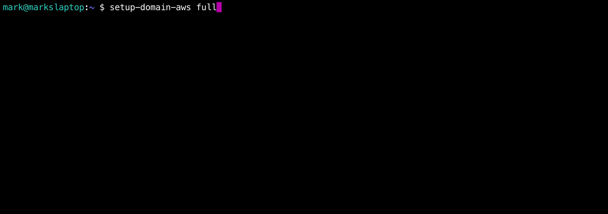

# setup-domain-aws

Automate the tedious process of domain registration, certificate setup, and GitHub secrets config.

 

### Installing & Running

    npm install -g setup-domain-aws
    setup-domain-aws [command] [options]

or

    npx setup-domain-aws [command] [options]

### How does it work?

With `setup-domain-aws`, you can automate this process:

  1. 🔗 **Registering a domain** (AWS Route53 Domains)
  2. 🥱 Waiting for domain registration request to complete
  3. ✅ Creating a Route53 Hosted Zone
  4. 🔐 **Requesting an ACM certificate**
  5. 📜 Adding DNS records for certificate validation
  6. 😴 Waiting for certificate validation to complete
  7. 🤫 **Setting GitHub Secrets for CI/CD** (HOSTED_ZONE_ID, DOMAIN, & CERTIFICATE_ARN)

This is as simple as running

    setup-domain-aws full --domain website.tld --region us-east-1 --repo username/repo_name

Note: you will need a GitHub Personal Access Token for the GitHub Secrets step.

### What if I don't need all that?

You can run any of the steps individually!

  - Use **register** for domain registration
    - example: `setup-domain-aws register --domain <domain> --region us-east-1`
  - Use **get-hosted-zone** to get the hosted zone id for a domain you've registered
    - example: `setup-domain-aws get-hosted-zone --domain <domain> --region us-east-1`
  - Use **cert** to request an ACM certificate
    - example: `setup-domain-aws cert --domain <domain> --region us-east-1`
  - Use **upload-config** to request an ACM certificate
    - example: `setup-domain-aws upload-config --repo <owner/repository>`

Also, if you run `setup-domain-aws full` and you've already completed some of the steps (for example, if you already own the domain), the CLI will skip over those steps.

### Command-line options vs prompts

The examples above use command-line options to supply information. If you don't do that (for example, if you just run `setup-domain-aws full`), the CLI will prompt you for each piece of information it needs.

Note: it is not possible, for security reasons, to pass the GitHub PAT as a command-line parameter. You will be prompted for this information.

### CI/CD considerations

When running `full` or `upload-config`, you can pass the option --get-pat-from-stdin and pipe it:

    # GitHub Actions example:
    echo ${{ secrets.PAT }} | setup-domain-aws upload-config --get-pat-from-stdin

    # Mac OS Keychain example:
    security find-generic-password -a ${USER} -s <keychain item name> -w | setup-domain-aws upload-config --get-pat-from-stdin

### TODOs

 - Allow subdomains to be passed to `setup-domain-aws full`, and parse the root domain for the `domain` step
 - Add support for other secret store solutions for `upload-config`
   - AWS Secrets Manager
   - AWS Systems Manager Parameter Store
